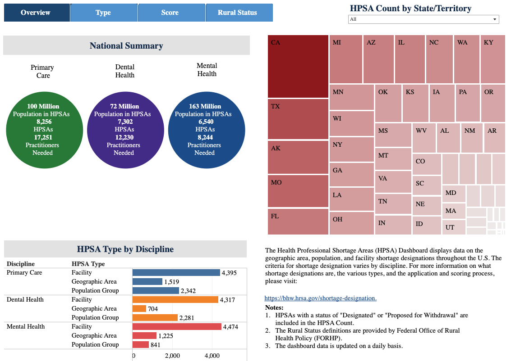
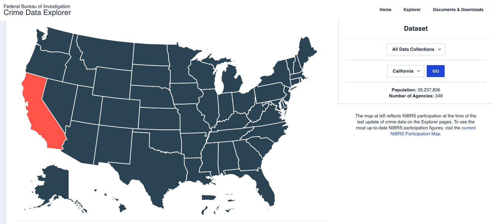
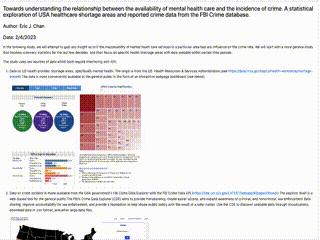
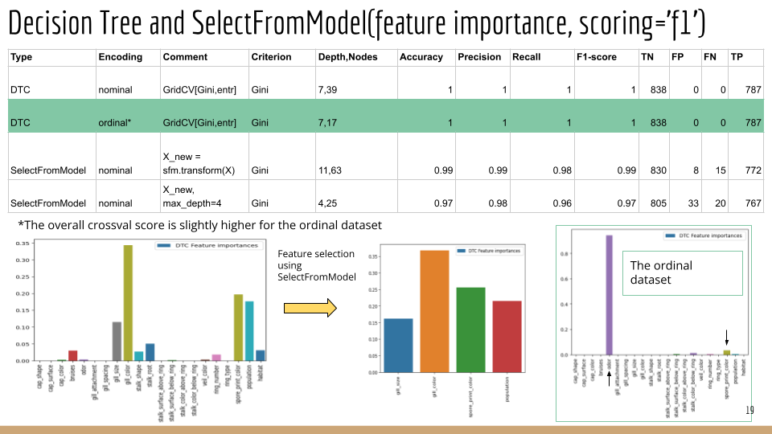
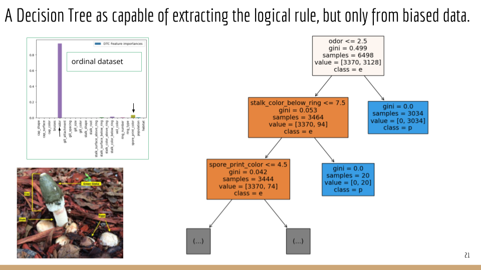
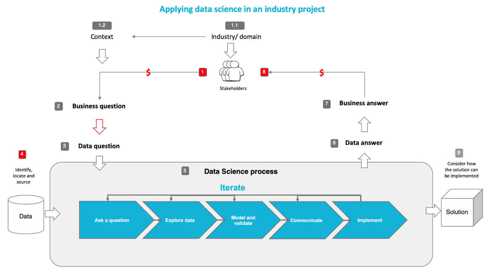

## Portfolio

---

### Data Science Projects 

1. Towards Understanding the Relationship Between the Availability of Mental Health Care and the Incidence of Crime. A Statistical Exploration of USA Healthcare Shortage Areas and Reported Crime Data from the FBI Crime Database.

  
  

  

    <!-- Text on the left -->
  <a href=" https://github.com/echanj/MHSA_vs_Crime_geomap.git">Clone the notebook from here !!!</a> 
  <a href=" ./miniproject1/mini_project_main_2023.html">Click here to view the online version!!!</a>
  

  

    <!-- GIF on the right -->
    
  

---
2. How Well Does ML Extract Simple Logic??? [Project Slides](./miniproject2/Mini_project2_presentation.pdf)

  

  

  

    <!-- Text on the left -->
  <a href=" https://github.com/echanj/logical_rule_extraction.git">Clone the notebook from here !!!</a> 
  <a href="./miniproject2/miniproject2_data_models.html">Click here to view the online version!!!</a>
  

  

    <!-- GIF on the right -->
    
  

---
[Project 3 Title](http://example.com/)

---

#### Foundational Data Science and AI Skills
 Python, Pandas, Numpy, Data Visualization, Data Cleansing, Data Manipulation, SQL, Tableau. 
####  Core Machine Learning Skills
 Scikit learn, Keras, Tensorflow. 
#### Data Science Soft Skills
Problem Solving, Collaboration, Leadership, Emotional Intelligence.

 <b>The End-to-End Data Science Flow<b> 
 
 ---
 ## Molecular Modeling and Simualtions:
- [Publications](https://sites.google.com/site/echanj/title-page-and-publications)
- [Software](https://sites.google.com/site/echanj/title-page-and-publications/molecular-crystals-research)
<!-->
- [Test to see if link is working](https://github.com/echanj/MHSA_vs_Crime_geomap/blob/main/mini_project_main_2023.html)
- [Project 2 Title](http://example.com/)
- [Project 3 Title](http://example.com/)
- [Project 4 Title](http://example.com/)
- [Project 5 Title](http://example.com/)
-->

 

---

---
<!-- 
Page template forked from <a href="https://github.com/evanca/quick-portfolio">evanca</a>
 -->
<!-- Remove above link if you don't want to attibute -->
